# BURGONOMICS — Ecosystem Architecture Overview (Layer 3 Constraint)

> **Factory Configuration**: Ecosystem architecture, two-app topology, Firebase Cloud Functions v2 backend, Petpooja POS bridge, Porter delivery, Razorpay Route, and support ticket escalator.  
> **Source of Truth**: [backend_upgrade_spec.md](../references/backend_upgrade_spec.md) and [ui_ux_spec.md](../references/ui_ux_spec.md).

---

## 1. Ecosystem Topology

```mermaid
flowchart TD
    subgraph Clients["Native Mobile Clients (Capacitor iOS & Android)"]
        CA["Customer App (burgonomics-foundation-core)\n- La Pino'z 3-Way Fulfillment (Delivery, Takeaway, Dine-In)\n- 1-Tap Quick Add (No Item Modifiers)\n- Floating Mini-Cart & Single-Page Checkout\n- Live Animated Order Tracker & Ticket Raiser"]
        PA["Partner POS & Admin App (burgonomics-partner)\n- Live KOT Stream & Outlet Operations\n- Dedicated 'Book Porter Rider' Screen\n- Branch-Specific Combo/Offer Creator\n- 3-Tier Ticket Escalator (Brand / Support / Dev)"]
    end

    subgraph FirebasePlatform["Firebase Backend (asia-south1 Mumbai - Blaze)"]
        subgraph Functions["Cloud Functions v2 (TypeScript in /functions)"]
            F_RP["payments: createOrder / verifyPayment / autoRefund / razorpayRouteSplit"]
            F_PP["petpooja: syncMenu / pushOrder / petpoojaWebhook / stockWebhook"]
            F_PR["porter: getQuote / bookRider / porterWebhook / rebookRider"]
            F_TICKETS["tickets: createTicket / resolveTicket / escalateTicket / reminderCron"]
            F_FCM["notifications: dispatchFCM / audioAlarmTrigger"]
            F_AUTH["auth: setCustomClaims / verifyPhoneOtp"]
        end

        subgraph DB["Cloud Firestore (Single Source of Truth)"]
            COL_ORDERS["orders/{orderId}"]
            COL_BRANCHES["branches/{branchId}"]
            COL_PRODUCTS["products/{productId}"]
            COL_USERS["users/{uid}"]
            COL_TICKETS["support_tickets/{ticketId}"]
            COL_NOTIFS["users/{uid}/notifications"]
            COL_AUDIT["payment_audits/{id}"]
            COL_DEVLOGS["dev_error_snapshots/{id}"]
        end

        subgraph Sched["Cloud Scheduler"]
            CRON_PP["Hourly Petpooja Menu Sync"]
            CRON_RETRY["Order Push Retry Queue Worker"]
            CRON_TICKETS["60-Minute Ticket Inactivity Reminder"]
        end
    end

    subgraph Gateways["External Service Gateways"]
        GW_RP["Razorpay PG & Route API (Marketplace Splits)"]
        GW_PP["Petpooja POS API (Menu V1 & Push Order V1)"]
        GW_PR["Porter Logistics API (Quote & Dispatch)"]
        GW_FCM["Firebase Cloud Messaging (FCM & APNS)"]
        GW_DEV["Slack / Discord Webhooks (P0 Dev Alerts)"]
    end

    %% Client Connections
    CA -->|Phone Auth & Payments| F_RP
    CA -->|Submit Issue / Raise Ticket| F_TICKETS
    CA -->|Live Tracking & Realtime Data| DB
    PA -->|Book Porter Rider| F_PR
    PA -->|Resolve / Escalate Ticket| F_TICKETS
    PA -->|Live Operations & Dev Logs| DB

    %% Backend Integrations
    F_RP <-->|Create Split / Verify HMAC / Reversal| GW_RP
    F_PP <-->|Hourly Ingestion / KOT Push / 86ing| GW_PP
    F_PR <-->|Fare Quotes & Driver Dispatch| GW_PR
    F_TICKETS -->|Alert Dev Team on Tech Failures| GW_DEV
    F_FCM -->|Push Triggers & Loud Audio Alerts| GW_FCM

    %% DB Updates
    F_RP -->|Update Order Payment & Split Ledger| COL_ORDERS
    F_PP -->|Update KOT / Kitchen Status| COL_ORDERS
    F_PR -->|Update Porter Rider Tracking| COL_ORDERS
    F_TICKETS -->|Manage Ticket State & Audit Trail| COL_TICKETS
    CRON_PP -->|Update Products & Modifiers| COL_BRANCHES
```

---

## 2. Core Architectural Invariants

1. **Pricing — Petpooja is Truth**: Menu item MRP is ingested hourly from Petpooja API. Authoritative totals are recomputed server-side in `createOrder` / `verifyPayment` Cloud Functions.
2. **Single Database**: Cloud Firestore is the single source of truth for customers, orders, branches, tickets, and loyalty points.
3. **Razorpay Route Marketplace Split**: Automated split at payment capture between Brand Owner (Royalty %) and Branch Manager Razorpay linked accounts.
4. **Porter Production Logistics**: Real-time quotes at checkout, partner manual dispatch screen, auto-alert on driver cancellation with 1-click rebook or in-house delivery fallback.
5. **Ticketing Escalator**: 3-tier escalation (Customer → Branch Manager → Brand Owner / Support / Developer) with automated 60-minute inactivity reminders and developer error snapshots.
6. **Unified Combos & Offers**: All burgers and sides are pre-configured (no modifier builder). Combos are created via Partner POS (Branch Owner for branch-only; Brand Owner/Support/Dev for all branches).
