# BURGONOMICS BACKEND UPGRADE — MASTER SPECIFICATION (Layer 3 Reference)

> **Architecture Target:** Firebase Cloud Functions v2 (Blaze in `asia-south1`), Cloud Firestore, Petpooja POS, Porter Delivery, Razorpay Route (Marketplace Royalty Split), Support Ticket Escalator, FCM, and Capacitor Native iOS/Android Apps.  
> **Source of Truth:** Interpretable Context Methodology (ICM) — Authoritative Execution Plan.

---

## 1. Executive Architecture Overview

```mermaid
flowchart TD
    subgraph Clients["Native Mobile Clients (Capacitor iOS & Android)"]
        CA["Customer App (burgonomics-foundation-core)\n- Order Placement & Live Tracking\n- Ticket Raiser & Issue Reporting\n- Phone Auth & Address Management"]
        PA["Partner POS & Admin App (burgonomics-partner)\n- Live Orders & KOT Stream\n- Dedicated 'Book Porter Rider' Screen\n- Support Ticket Resolution & Escalator\n- Dev Diagnostics Console"]
    end

    subgraph FirebaseCloud["Firebase Platform (Blaze Plan - asia-south1 Mumbai)"]
        subgraph Functions["Firebase Cloud Functions v2 (TypeScript in /functions)"]
            F_RP["payments: createOrder / verifyPayment / autoRefund / razorpayRouteSplit"]
            F_PP["petpooja: syncMenu / pushOrder / petpoojaWebhook / stockWebhook"]
            F_PR["porter: getQuote / bookRider / porterWebhook / rebookRider"]
            F_TICKETS["tickets: createTicket / resolveTicket / escalateTicket / reminderCron"]
            F_FCM["notifications: dispatchFCM / audioAlarmTrigger"]
            F_AUTH["auth: setCustomClaims / verifyPhoneOtp"]
        end

        subgraph DB["Cloud Firestore (Real-time NoSQL)"]
            COL_ORDERS["orders/{orderId}"]
            COL_BRANCHES["branches/{branchId}"]
            COL_PRODUCTS["products/{productId}"]
            COL_USERS["users/{uid}"]
            COL_TICKETS["support_tickets/{ticketId}"]
            COL_NOTIFS["users/{uid}/notifications"]
            COL_AUDIT["payment_audits/{id}"]
            COL_DEVLOGS["dev_error_snapshots/{id}"]
        end

        subgraph Sched["Cloud Scheduler"]
            CRON_PP["Hourly Petpooja Menu Sync"]
            CRON_RETRY["Order Push Retry Queue Worker"]
            CRON_TICKETS["60-Minute Ticket Inactivity Reminder Worker"]
        end
    end

    subgraph External["External Service Gateways"]
        GW_RP["Razorpay PG & Route API (Marketplace Transfers)"]
        GW_PP["Petpooja POS API (Menu V1 & Push Order V1)"]
        GW_PR["Porter Logistics API (Quote & Dispatch)"]
        GW_FCM["Firebase Cloud Messaging (APNS & FCM)"]
        GW_DEV["Slack / Discord Webhooks (P0 Developer Alerts)"]
    end

    %% Client Interactions
    CA -->|Native Razorpay SDK / Phone Auth| F_RP
    CA -->|Submit Issue / Raise Ticket| F_TICKETS
    CA -->|Live Order Tracking & Menu Stream| DB
    PA -->|Book Porter Rider & Dispatch| F_PR
    PA -->|Resolve / Refund / Escalate Ticket| F_TICKETS
    PA -->|Dev Diagnostics & Logs Review| DB

    %% Backend Flows
    F_RP <-->|Create Split Order / Verify HMAC / Route Reversal| GW_RP
    F_PP <-->|Hourly Ingestion / KOT Push / 86ing Webhooks| GW_PP
    F_PR <-->|Fare Quotes & Driver Dispatch| GW_PR
    F_TICKETS -->|Alert Dev Team on Technical Failures| GW_DEV
    F_FCM -->|Push Triggers & Loud Audio Alerts| GW_FCM

    %% Database Writes
    F_RP -->|Update Payment Status & Split Ledger| COL_ORDERS
    F_PP -->|Update KOT / Kitchen Status| COL_ORDERS
    F_PR -->|Update Porter Rider Tracking| COL_ORDERS
    F_TICKETS -->|Manage Ticket State & Audit Trail| COL_TICKETS
    CRON_PP -->|Update Menu Items & Modifiers| COL_BRANCHES
```



---

## 2. Core Decisions Matrix (Authoritative Grill Ledger)

| Dimension | Decision | Detailed Rationale & Mechanism |
| :--- | :--- | :--- |
| **Backend Runtime** | **Firebase Cloud Functions v2 (Blaze, `asia-south1`)** | Native Firestore triggers, Cloud Scheduler, zero cross-cloud latency to Indian gateways (Petpooja, Porter, Razorpay). Decommissions Netlify Functions. |
| **Client Target** | **Mobile Native Only (iOS & Android via Capacitor)** | Pure App Store & Play Store native builds with native `@capacitor/push-notifications`, `@capacitor/geolocation`, and native Razorpay SDK. |
| **Project Structure** | **Root `/functions` Package** | Unified TypeScript backend codebase serving both Customer and Partner apps against a single Firestore database. |
| **Franchise Royalty** | **Razorpay Route (Marketplace Split)** | Split at payment capture: Brand Royalty % (e.g. 5–10% in `branches/{id}.royaltyPercentage`) calculated on Food Subtotal retained in Brand Master Account; net branch revenue transferred to linked Branch Razorpay Account. Route auto-reverses on refunds. |
| **Ticketing System** | **Customer Ticket Raiser + 3-Tier Escalator** | Customer raises ticket (auto-assigned to Branch Manager). Branch Manager resolves with full/partial refunds or coupons, or manually escalates to **Brand Owner**, **Support Team**, or **Developer Team**. 60-minute inactivity re-ping alert for branches. |
| **Dev Diagnostics** | **Error Snapshots + Dev Console** | Dev Team tickets automatically capture failed API payloads, Razorpay IDs, Porter status, and Petpooja response codes with optional Slack/Discord webhook alerts for P0 bugs. |
| **Petpooja POS** | **Event Push + Instant 86ing Webhook + Auto-Refund** | Pushes orders on payment confirmation with exponential backoff retries (1m, 5m, 30m). Item out-of-stock webhooks instantly disable items. Kitchen item rejection post-checkout triggers auto-refund of differential amount. |
| **Porter Delivery** | **Real-Time Quote at Checkout + Partner 'Book Rider' Screen** | Customer pays exact live Porter quote at checkout. Branch Manager manually dispatches Porter rider from dedicated screen. Auto-alert on rider cancellation with 1-click rebook / in-house delivery fallback. Fare surge deltas absorbed by branch ledger. |
| **Payments** | **Razorpay Dual Verification + COD + Auto-Refunds** | Server-created Razorpay orders, HMAC signature verification, idempotent webhooks (`order.paid`), full & partial refund support, and native COD handling. |
| **Push Notifications** | **FCM + Firestore Notifications + Loud POS Audio** | High-priority native push notifications, in-app notification center, and looping audio alarm on Partner POS for new orders. |
| **Auth & RBAC** | **Firebase Phone OTP (Customer) + Custom Claims (Partner)** | Secure SMS OTP for buyers; `brand_owner`, `branch_manager`, `kitchen_staff` role claims for POS & strict Firestore security rules. |
| **Sandbox & Secrets** | **Secret Manager + Graceful Mock Fallbacks** | Development sandbox mocks third-party APIs if credentials are not yet supplied, preventing crashes. |

---

## 3. Deep Component Specifications

### 3.1. Razorpay Route & Marketplace Royalty Split Architecture

#### 1. Split Calculation Formula
For an online order:
```ts
// Calculate split amounts in paise (INR cents)
const foodSubtotalPaise = Math.round(order.pricing.foodSubtotal * 100);
const packagingPaise = Math.round(order.pricing.packagingFee * 100);
const deliveryPaise = Math.round(order.pricing.deliveryFee * 100);
const gstPaise = Math.round(order.pricing.gst * 100);
const discountPaise = Math.round(order.pricing.discount * 100);

// Branch specific royalty percentage (e.g. 7%)
const royaltyPercentage = branch.royaltyPercentage || 7;
const brandRoyaltyPaise = Math.round((foodSubtotalPaise - discountPaise) * (royaltyPercentage / 100));

// Net branch transfer amount
const branchTransferPaise = (foodSubtotalPaise - discountPaise - brandRoyaltyPaise) + packagingPaise + deliveryPaise + gstPaise;
```

#### 2. Razorpay Route Transfer Execution
During `verifyRazorpayPayment` or Razorpay `payment.captured` webhook:
```ts
if (order.payment.method === "razorpay" && branch.razorpayAccountId) {
  await razorpay.payments.transfer(razorpayPaymentId, {
    transfers: [
      {
        account: branch.razorpayAccountId,
        amount: branchTransferPaise,
        currency: "INR",
        notes: {
          orderId: order.id,
          branchId: order.branchId,
          brandRoyalty: brandRoyaltyPaise / 100
        },
        linked_account_notes: ["orderId"],
        on_hold: 0 // Immediate settlement
      }
    ]
  });
}
```

#### 3. Reversal on Refund (Full or Partial)
When a refund is triggered (via ticket resolution or cancellation):
```ts
await razorpay.payments.refund(razorpayPaymentId, {
  amount: refundAmountPaise,
  reverse_all: 1 // Automatically reverses the split transfer proportionally from the branch account
});
```

---

### 3.2. Support Ticketing & Multi-Tier Escalation System

#### 1. Customer Ticket Raiser (Customer App)
- **Entry Points**:
  - `Order Details Screen` → "Need Help with this Order"
  - `Profile / Drawer` → "Help & Support" → "Raise a New Ticket"
- **Categories**:
  - `wrong_item` (Missing or incorrect item delivered)
  - `late_delivery` (Delivery significantly delayed)
  - `food_quality` (Taste, hygiene, or packaging damage)
  - `payment_issue` (Charged but order not placed, refund pending)
  - `app_bug` (App crash, UI error, coupon failure)
  - `general_inquiry` (Franchise, general feedback)
- **Data Model (`support_tickets/{ticketId}`)**:
  ```ts
  interface SupportTicket {
    id: string;
    ticketNumber: string; // e.g. "TICK-2026-8942"
    customerId: string;
    customerName: string;
    customerPhone: string;
    orderId?: string;
    branchId: string;
    category: TicketCategory;
    priority: "low" | "medium" | "high" | "urgent";
    status: "open" | "in_progress" | "escalated" | "resolved" | "closed";
    subject: string;
    description: string;
    attachments: string[]; // Firebase Storage URLs
    assignedTo: {
      tier: "branch" | "brand_support" | "developer_team";
      assigneeId?: string;
      assigneeName?: string;
    };
    timeline: TicketEvent[];
    resolution?: {
      action: "full_refund" | "partial_refund" | "discount_coupon" | "loyalty_credit" | "explanation";
      amount?: number;
      couponCode?: string;
      resolvedBy: string;
      resolvedAt: Timestamp;
      notes: string;
    };
    diagnostics?: {
      razorpayPaymentId?: string;
      porterOrderId?: string;
      petpoojaOrderId?: string;
      errorStack?: string;
      clientAppVersion?: string;
      deviceInfo?: string;
    };
    createdAt: Timestamp;
    updatedAt: Timestamp;
    lastActivityAt: Timestamp;
    branchReminderSent: boolean;
  }
  ```

#### 2. Branch Manager Resolution (Partner App)
- Real-time alert in Partner POS when a customer raises an order issue.
- **Resolution Options**:
  1. **Instant Full Refund**: Issues 100% refund via Razorpay with Route transfer reversal.
  2. **Instant Partial Refund**: Selects specific missing/damaged items, computes amount, executes partial Razorpay refund.
  3. **Goodwill Coupon / Loyalty Credit**: Issues a custom promo coupon (e.g. ₹100 OFF next order) or adds loyalty points to customer account.
  4. **Chat & Explanation**: Sends message to customer in-app ticket conversation.

#### 3. Escalator & Inactivity Reminder
- **60-Minute Inactivity Cron**: A scheduled Cloud Function checks for tickets with `status: "open"` and `assignedTo.tier: "branch"` created >60 minutes ago without activity. Dispatches high-priority reminder notification & sound alert to the branch manager.
- **Manual Escalation Buttons in Partner POS**:
  - **[ 🏢 Escalate to Brand Support ]**: For major customer disputes, franchise policy questions, or brand-level compensation.
  - **[ 💻 Escalate to Developer Team ]**: For app crashes, payment transaction drops, POS sync errors, or webhook failures.

#### 4. Developer Team Diagnostics Pipeline
- When a ticket is escalated to `developer_team`:
  - The backend automatically attaches an `errorSnapshot` (capturing failed API payloads, Razorpay IDs, Porter status, Petpooja KOT responses, and client stack traces).
  - Saved to `dev_error_snapshots/{id}`.
  - Dispatches an automated alert to the Developer Slack / Discord Webhook channel `#burgonomics-alerts-p0`.
  - Accessible directly in Partner App under `System Settings` → `Developer Diagnostics Console`.

---

### 3.3. Petpooja POS Integration & Menu Sync Hardening

1. **Hourly Menu Sync (`syncPetpoojaMenu`)**:
   - Fetches menu from `GET /get_menu` (`https://qle1yy2ydc.execute-api.ap-southeast-1.amazonaws.com/V1/get_menu`).
   - Maps categories, items, variant attributes, and add-on groups.
   - Updates `branches/{branchId}/menu` and `products` collection with `petpoojaItemId`, `inStock`, `mrpPrice`, `lastPetpoojaSync`.

2. **Instant Stock Out (86ing) Webhook (`petpoojaStockWebhook`)**:
   - Petpooja calls `POST /petpoojaStockWebhook` when kitchen turns off an item/modifier.
   - Instantly updates `branches/{branchId}/menu/{itemId}.inStock = false` and disables add-on modifiers.
   - Customer App receives instant Firestore `onSnapshot` update, disabling the "Add to Cart" button in real-time.

3. **Order Push & Outage Tolerance (`pushOrderToPetpooja`)**:
   - Pushes KOT to Petpooja `push_order` API upon payment confirmation.
   - If Petpooja API returns an error or times out:
     - Sets `orders/{orderId}.petpoojaStatus = "pending_retry"`.
     - Cloud Scheduler retry worker retries at 1m, 5m, 30m.
     - Partner POS displays an urgent "Retry Petpooja Push" button for manual submission.

4. **Kitchen Item Rejection & Partial Auto-Refund**:
   - If the kitchen marks an item unavailable after order placement, Petpooja sends an item rejection webhook.
   - Backend automatically calculates the rejected item price + 5% GST, executes partial refund via Razorpay, updates `orders/{id}.items`, and triggers an FCM notification to the customer.

---

### 3.4. Porter Delivery Logistics & Partner 'Book Rider' Screen

1. **Checkout Fare Quote (`getDeliveryQuote`)**:
   - Fetches live Porter 2-Wheeler (Bike) fare from `api.porter.in/v1/orders/quote` based on branch pickup GPS to customer drop GPS.
   - Displays exact fare at checkout.

2. **Dedicated 'Book Porter Rider' Screen in Partner POS**:
   - When food preparation is nearly complete (`food_ready`), the Branch Manager opens the order on the **Delivery Dispatch Screen**.
   - Displays:
     - Delivery Address, Distance, Customer Phone
     - Food Ready Status
     - Live Porter Fare Quote (e.g. ₹52)
     - **[ 🛵 Book Porter Rider ]** Action Button
     - **[ 👤 Assign In-House Rider ]** Fallback Button

3. **Porter Webhook & Driver Tracking (`porterWebhook`)**:
   - Verifies HMAC signature with `PORTER_WEBHOOK_SECRET`.
   - Event updates:
     - `DRIVER_ALLOCATED` → Stores driver name, phone, vehicle number, and live tracking URL.
     - `ARRIVED_AT_PICKUP` → Alerts Partner POS with audio chime ("Rider has arrived at store").
     - `STARTED_DELIVERY` → Sets `status.kind = "out_for_delivery"`.
     - `DELIVERED` → Sets `status.kind = "delivered"`.

4. **Rider Cancellation & No-Show Resilience**:
   - If Porter sends `RIDER_CANCELLED` or `NO_RIDERS_FOUND`:
     - Sets `orders/{id}.deliveryStatus = "rider_cancelled"`.
     - Displays high-priority banner on Partner POS with **[ 🔄 Re-book Porter ]** or **[ 🛵 Switch to In-House Delivery ]**.
     - Any fare surge delta during re-booking is absorbed by branch ledger.

---

### 3.5. FCM Push Notifications & Capacitor Native Capabilities

1. **Native Capacitor Plugins**:
   - `@capacitor/push-notifications`: Native APNS (iOS) & FCM (Android) token registration.
   - `@capacitor/geolocation`: High-accuracy GPS positioning with reverse geocoding.
   - `capacitor-razorpay` / Razorpay Mobile SDK for native checkout.

2. **Notification Topics & Sounds**:
   - `order_{orderId}`: Real-time status changes for the ordering customer.
   - `branch_{branchId}`: New incoming orders with **custom loud ringing sound (`new_order.wav`)** looping until acknowledged by branch staff.
   - `brand`: Global announcements and marketing promotions.
   - `support_ticket_{ticketId}`: Real-time ticket chat and status updates.

3. **In-App Notification Center**:
   - Backed by `users/{uid}/notifications` Firestore collection as source of truth.

---

## 4. Environment Variables & Secret Configuration

```bash
# Firebase Cloud Functions (asia-south1)
FIREBASE_PROJECT_ID=burgonomics-prod
FIREBASE_REGION=asia-south1

# Razorpay (Production / Sandbox)
RAZORPAY_KEY_ID=rzp_live_xxxxxxxx
RAZORPAY_KEY_SECRET=xxxxxxxxxxxxxxxxxxxxxxxx
RAZORPAY_WEBHOOK_SECRET=whsec_xxxxxxxxxxxx

# Petpooja POS
PETPOOJA_ENABLED=true
PETPOOJA_APP_KEY=xxxxxxxx
PETPOOJA_APP_SECRET=xxxxxxxx
PETPOOJA_ACCESS_TOKEN=xxxxxxxx
PETPOOJA_MENU_URL=https://qle1yy2ydc.execute-api.ap-southeast-1.amazonaws.com/V1
PETPOOJA_ORDER_URL=https://47pfzh5sf2.execute-api.ap-southeast-1.amazonaws.com/V1

# Porter Logistics
PORTER_ENABLED=true
PORTER_API_KEY=prt_live_xxxxxxxx
PORTER_CUSTOMER_ID=cust_xxxxxxxx
PORTER_WEBHOOK_SECRET=prt_whsec_xxxxxxxx
PORTER_BASE_URL=https://api.porter.in

# Developer Alerting Webhooks
SLACK_DEV_WEBHOOK_URL=https://hooks.slack.com/services/xxx/yyy/zzz
DISCORD_DEV_WEBHOOK_URL=https://discord.com/api/webhooks/xxx/yyy

# Feature Flags & Dev Sandbox Mode
MOCK_PAYMENT_GATEWAY=false
MOCK_PORTER_DISPATCH=false
MOCK_PETPOOJA_POS=false
```

---

## 5. Execution Roadmap & Verification Gates

### Stage 1: Firebase Project & Functions Scaffold
- [x] Initialize `/functions` workspace with TypeScript, Node.js 20, and Firebase Functions v2 (`firebase-functions/v2`).
- [x] Configure `firebase.json` with `asia-south1` deployment region and Secret Manager definitions.
- [x] Implement sandbox mock engine for all external APIs so smoke tests pass without live keys.

### Stage 2: Authoritative Server Pricing, Razorpay Route & Split Settlement
- [x] Build `pricing.engine.ts` supporting Petpooja MRP, 5% GST, loyalty points, coupons, and Porter delivery fee.
- [x] Implement `createRazorpayOrder` and `verifyRazorpayPayment` with timing-safe HMAC validation.
- [x] Implement **Razorpay Route** marketplace transfers splitting Brand Royalty % vs Branch net earnings.
- [x] Implement `razorpayWebhook` idempotent receiver and auto-refund / split reversal triggers.

### Stage 3: Support Ticketing System & 3-Tier Escalator
- [x] Implement Customer Ticket Raiser API (`createTicket`, `getTickets`, `addTicketMessage`).
- [x] Build Partner App Ticket Resolution UI with instant partial/full refund, goodwill coupon issuance, and manual escalation.
- [x] Build 60-Minute Inactivity Reminder Cloud Scheduler worker.
- [x] Implement Developer Diagnostics pipeline saving `dev_error_snapshots` and triggering Slack/Discord P0 webhooks.

### Stage 4: Petpooja POS Integration & Stock Hardening
- [x] Implement Cloud Scheduler hourly `syncPetpoojaMenu` and on-demand sync endpoint.
- [x] Implement `petpoojaStockWebhook` for instant 86ing (Out-of-Stock) item synchronization.
- [x] Implement `pushOrderToPetpooja` upon payment confirmation with retry queue (1m, 5m, 30m).
- [x] Implement `petpoojaWebhook` for real-time kitchen state transitions (`accepted`, `food_ready`, `cancelled`) and partial auto-refunds.

### Stage 5: Porter Delivery Logistics & Partner 'Book Rider' Screen
- [x] Build Porter Quote API client for live checkout delivery fare calculations.
- [x] Implement `bookPorterRider` Cloud Function invoked by the Partner App.
- [x] Implement `porterWebhook` tracking driver allocation, pickup, in-transit, and delivery completion.
- [x] Add 'Book Rider' and 'Assign In-House' fallback UI states to Partner POS with rider cancellation auto-alerts.

### Stage 6: Push Notifications & Capacitor Mobile Hardening
- [x] Implement `dispatchFCM` Cloud Function targeting `order_{id}`, `branch_{id}`, `brand`, and `support_ticket_{id}` topics.
- [x] Configure `@capacitor/push-notifications` with native sound channels on Android (`new_order.wav`) and APNS on iOS.
- [x] Set up `@capacitor/geolocation` and native Razorpay checkout in mobile builds.

### Stage 7: Security Verification & Final Smoke Gate
- [x] Run `npx tsc --noEmit` across `/functions`, `burgonomics-foundation-core`, and `burgonomics-partner`.
- [x] Verify Firestore Security Rules against custom claims (`brand_owner`, `branch_manager`, `cashier`).
- [x] Execute end-to-end sandbox purchase flow: Cart → Realtime Porter Quote → Razorpay Route Split Payment → Petpooja KOT Push → Partner Book Rider → Ticket Creation → Escalation to Dev Team.
