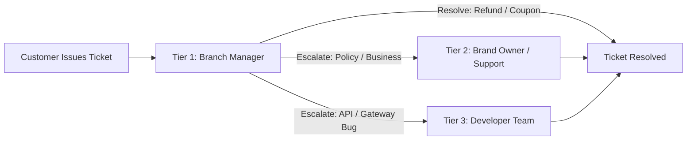

# BURGONOMICS — Unified Support Ticketing & 3-Tier Escalator (Layer 3 Constraint)

> **Reference Specification**: Customer ticket submission, Branch Manager resolution, 3-tier escalation (Brand Owner / Support / Developer), 60-minute inactivity reminders, and developer diagnostics.

---

## 1. Ticket Creation & Auto-Assignment
- Customer raises a ticket from the live order tracker or profile screen (`Missing Item`, `Quality Issue`, `Delivery Delay`, `Billing`).
- Ticket document created in `support_tickets/{ticketId}` and auto-assigned to the relevant `branch_manager` (`currentAssignee.tier = 'branch_manager'`).
- Push notification sent to the branch manager POS.

---

## 2. 3-Tier Escalator Workflow

1. **Tier 1 (Branch Manager)**:
   - Can issue instant Razorpay refunds or compensation coupon codes.
   - Can escalate if the issue requires corporate or technical intervention.
2. **Tier 2 (Brand Owner & Central Support)**:
   - Handles multi-outlet disputes, customer goodwill vouchers, and staff misconduct issues.
3. **Tier 3 (Developer Team)**:
   - Receives automatic `dev_error_snapshots` containing request payloads, Razorpay IDs, and stack traces.
   - Optional Slack/Discord webhook alerts for critical payment/POS bugs.

---

## 3. 60-Minute Inactivity Reminder Cron
- Cloud Scheduler executes `ticketInactivityCron` every 15 minutes.
- If a ticket remains in `open` status with no action for > 60 minutes, an escalated reminder notification is pushed to the Branch Manager and CC'd to Central Support.
